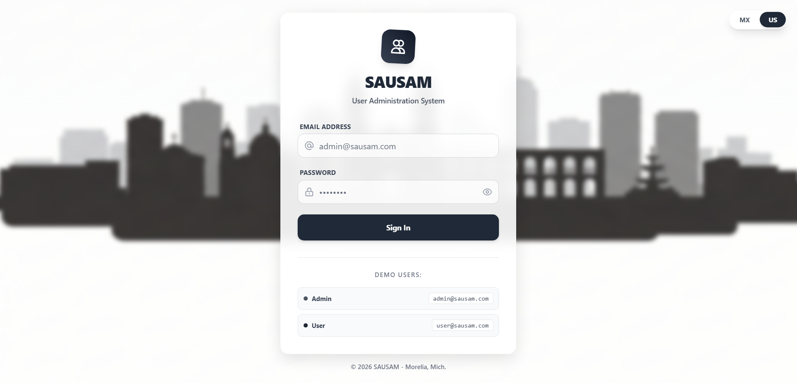
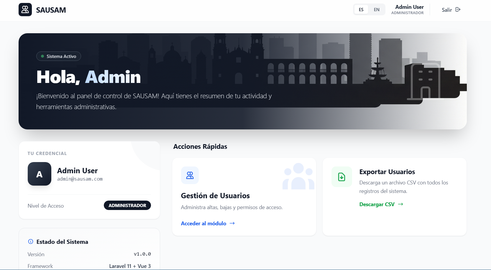
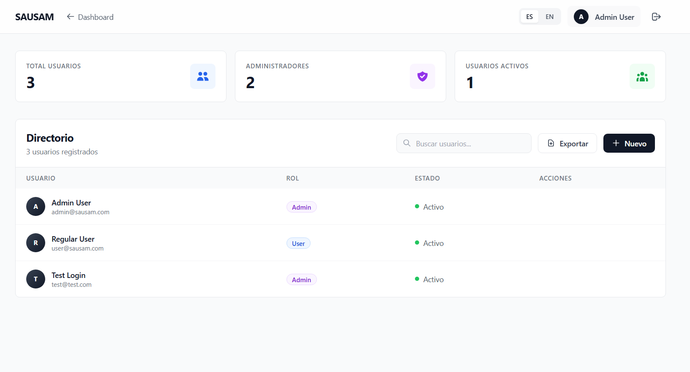

# SAUSAM - Sistema de Administración de Usuarios de Samuel García

Sistema CRUD completo de gestión de usuarios con autenticación, sistema de roles, exportación a CSV e internacionalización (Español/Inglés).


## Cómo iniciar el proyecto

### Paso 1: Clonar el repositorio
```bash
git clone https://github.com/SAGZ7/sausam.git
cd sausam
```

### Paso 2: Construir las imágenes de Docker
```bash
docker-compose build
```
**NOTA:** Este paso tarda aproximadamente 10-15 minutos la primera vez porque instala todas las dependencias de PHP y Node.js. Solo es necesario hacerlo una vez.

### Paso 3: Levantar los contenedores
```bash
docker-compose up -d
```
Los servicios estarán disponibles en:
- Frontend: http://localhost:5173
- Backend API: http://localhost:8000
- PostgreSQL: localhost:5432

### Paso 4: Configurar el backend
```bash
# Copiar archivo de configuración
docker exec sausam_backend cp .env.example .env

# Generar clave de aplicación
docker exec sausam_backend php artisan key:generate

# Ejecutar migraciones
docker exec sausam_backend php artisan migrate --force

# Crear usuarios de prueba
docker exec sausam_backend php artisan db:seed --class=UserSeeder --force
```

### Paso 5: Acceder a la aplicación
Abrir en el navegador: **http://localhost:5173**

### Usuarios de Prueba
- **Administrador:** admin@sausam.com / password (Acceso completo: CRUD, exportación CSV)
- **Usuario Regular:** user@sausam.com / password (Solo lectura)

---


### Detener los contenedores
```bash
docker-compose down
```

### Reiniciar los contenedores (rápido, sin rebuild)
```bash
docker-compose down
docker-compose up -d
```

### Ver logs en tiempo real
```bash
docker-compose logs -f backend
docker-compose logs -f frontend
```

### Ejecutar tests unitarios
```bash
docker exec sausam_backend php artisan test
```
Resultado esperado: 14 tests, 50 assertions - PASS

### Limpiar completamente (eliminar datos)
```bash
docker-compose down -v
docker system prune -af
```

### Backend (Laravel 11)
- CRUD Completo de usuarios con validación robusta
- Autenticación API con Laravel Sanctum (token-based)
- Sistema de Roles (Administrador y Usuario Regular)
- Middleware personalizado para protección de rutas por rol
- Exportación a CSV con Laravel Excel
- API RESTful con responses consistentes
- Tests unitarios (PHPUnit) - 14 tests pasando
- Migraciones y Seeders con datos de prueba

### Frontend (Vue 3 + Composition API)
- Interfaz moderna estilo Linear/Enterprise con Tailwind CSS
- Internacionalización (i18n) Español/Inglés
- Autenticación persistente con localStorage
- CRUD interactivo con modales y validación en tiempo real
- Paginación de resultados
- Búsqueda en tiempo real de usuarios
- Protección XSS automática de Vue
- Diseño responsive mobile-first
- Animaciones y transiciones suaves

### DevOps
- Containerización completa con Docker Compose
- PostgreSQL 15 en contenedor
- Hot-reload en desarrollo (Vite)
- Volúmenes persistentes para la base de datos

## Stack Tecnológico

### Backend
- **Framework:** Laravel 11.x
- **Lenguaje:** PHP 8.3
- **Autenticación:** Laravel Sanctum
- **Base de datos:** PostgreSQL 15
- **Exportación:** Laravel Excel (Maatwebsite)
- **Testing:** PHPUnit

### Frontend
- **Framework:** Vue 3 (Composition API)
- **Build Tool:** Vite 5.x
- **Router:** Vue Router 4.x
- **HTTP Client:** Axios
- **Estilos:** Tailwind CSS 3.x
- **Validación:** Vuelidate

### Infraestructura
- **Containerización:** Docker & Docker Compose
- **Base de datos:** PostgreSQL 15 Alpine


## API Endpoints

### Autenticación
```
POST   /api/register    - Registrar nuevo usuario
POST   /api/login       - Iniciar sesión
POST   /api/logout      - Cerrar sesión (requiere auth)
GET    /api/me          - Obtener usuario autenticado
```

### Gestión de Usuarios (requiere autenticación)
```
GET    /api/users           - Listar usuarios (paginado)
GET    /api/users/{id}      - Ver usuario específico
POST   /api/users           - Crear usuario (solo admin)
PUT    /api/users/{id}      - Actualizar usuario (solo admin)
DELETE /api/users/{id}      - Eliminar usuario (solo admin)
GET    /api/users-export    - Exportar usuarios a CSV (solo admin)
```


## Características de Seguridad

- Contraseñas hasheadas con bcrypt
- Autenticación basada en tokens (Sanctum)
- Middleware de roles para proteger rutas sensibles
- Validación de datos en frontend y backend
- Protección CSRF
- Headers CORS configurados correctamente
- Protección XSS automática de Vue
- Tokens con expiración configurable

## Testing

### Ejecutar tests del backend
```bash
# Ejecutar todos los tests
docker exec sausam_backend php artisan test
```

**Tests implementados:**
- Registro de usuarios
- Login con credenciales válidas e inválidas
- Logout
- Listar usuarios (admin y user)
- Crear usuario (solo admin)
- Actualizar usuario (solo admin)
- Eliminar usuario (solo admin)
- Protección de rutas no autenticadas

**Resultado:** 14 tests, 50 assertions - PASS

## Capturas de Pantalla

### Vista de Login


### Dashboard Principal


### Gestión de Usuarios


## Video Demostración

Ver video completo de demostración del sistema: [SAUSAM - Demo en YouTube](TU_LINK_DE_YOUTUBE_AQUI)

## Notas de Desarrollo

### Decisiones Técnicas

1. **Laravel Sanctum** Se eligió Sanctum por ser la solución oficial de Laravel para SPAs, más simple de implementar y mantener.

2. **Composition API** Se utilizó Composition API de Vue 3 por ser más moderno, permitir mejor reutilización de lógica y mejor tipado.

3. **Tailwind CSS** Elegido por permitir desarrollo rápido, diseño consistente y producir CSS optimizado en producción.

4. **Docker** Facilita la portabilidad del proyecto y garantiza que funcione igual en cualquier entorno.

5. **PostgreSQL** PostgreSQL elegido por sus características enterprise, mejor soporte para JSON y tipos de datos avanzados.

### Buenas Prácticas Implementadas

- Código modular y reutilizable (composables en Vue)
- Separación de responsabilidades (Controllers, Services, Models)
- Validación en frontend y backend (defensa en profundidad)
- Nombres descriptivos de variables y funciones
- Commits atómicos con mensajes descriptivos
- Migraciones versionadas para control de cambios en BD
- Seeders para datos de prueba reproducibles
- Tests automatizados para features críticas

## Problemas Conocidos y Soluciones

### El frontend no carga los usuarios
**Causa:** Backend no está conectado a PostgreSQL
**Solución:** Verificar que el `.env` tenga `DB_CONNECTION=pgsql` y no `sqlite`

### Error 422 en login
**Causa:** Hash de contraseñas no coincide
**Solución:** Recrear usuarios con `php artisan db:seed --class=UserSeeder`

### Docker no inicia
**Causa:** Virtualización no habilitada en BIOS
**Solución:** Habilitar Intel VT-x o AMD-V en BIOS

## Recursos Adicionales

- [Documentación de Laravel 11](https://laravel.com/docs/11.x)
- [Documentación de Vue 3](https://vuejs.org/guide/introduction.html)
- [Tailwind CSS](https://tailwindcss.com/docs)
- [Laravel Sanctum](https://laravel.com/docs/11.x/sanctum)
- [Docker Compose](https://docs.docker.com/compose/)

## Estructura del Proyecto
```
sausam/
├── backend/                      # Laravel 11 API
│   ├── app/
│   │   ├── Http/
│   │   │   ├── Controllers/API/
│   │   │   │   ├── AuthController.php
│   │   │   │   └── UserController.php
│   │   │   └── Middleware/
│   │   │       └── CheckRole.php
│   │   ├── Models/
│   │   │   └── User.php
│   │   └── Exports/
│   │       └── UsersExport.php
│   ├── database/
│   │   ├── migrations/
│   │   │   ├── create_users_table.php
│   │   │   ├── create_personal_access_tokens_table.php
│   │   │   └── add_role_and_phone_to_users_table.php
│   │   └── seeders/
│   │       └── UserSeeder.php
│   ├── routes/
│   │   └── api.php
│   ├── tests/
│   │   └── Feature/
│   │       ├── AuthTest.php
│   │       └── UserTest.php
│   └── Dockerfile
│
├── frontend/                     # Vue 3 SPA
│   ├── src/
│   │   ├── assets/
│   │   │   └── morelia-skyline.png
│   │   ├── components/
│   │   ├── views/
│   │   │   ├── Login.vue
│   │   │   ├── Dashboard.vue
│   │   │   └── Users.vue
│   │   ├── composables/
│   │   │   ├── useAuth.js
│   │   │   ├── useUsers.js
│   │   │   └── useLocale.js
│   │   ├── locales/
│   │   │   ├── es.js
│   │   │   └── en.js
│   │   ├── router/
│   │   │   └── index.js
│   │   ├── services/
│   │   │   └── api.js
│   │   ├── App.vue
│   │   ├── main.js
│   │   └── style.css
│   ├── public/
│   │   └── favicon.svg
│   ├── index.html
│   ├── package.json
│   ├── tailwind.config.js
│   ├── vite.config.js
│   └── Dockerfile
│
├── docker-compose.yml
├── .env.example
└── README.md
```


Este proyecto fue desarrollado como prueba técnica - Enero 2025


- Proyecto: SAUSAM (Sistema de Administración de Usuarios)
- Fecha: Enero 2025

---

**Desarrollado con Laravel 11 + Vue 3 + PostgreSQL + Docker**